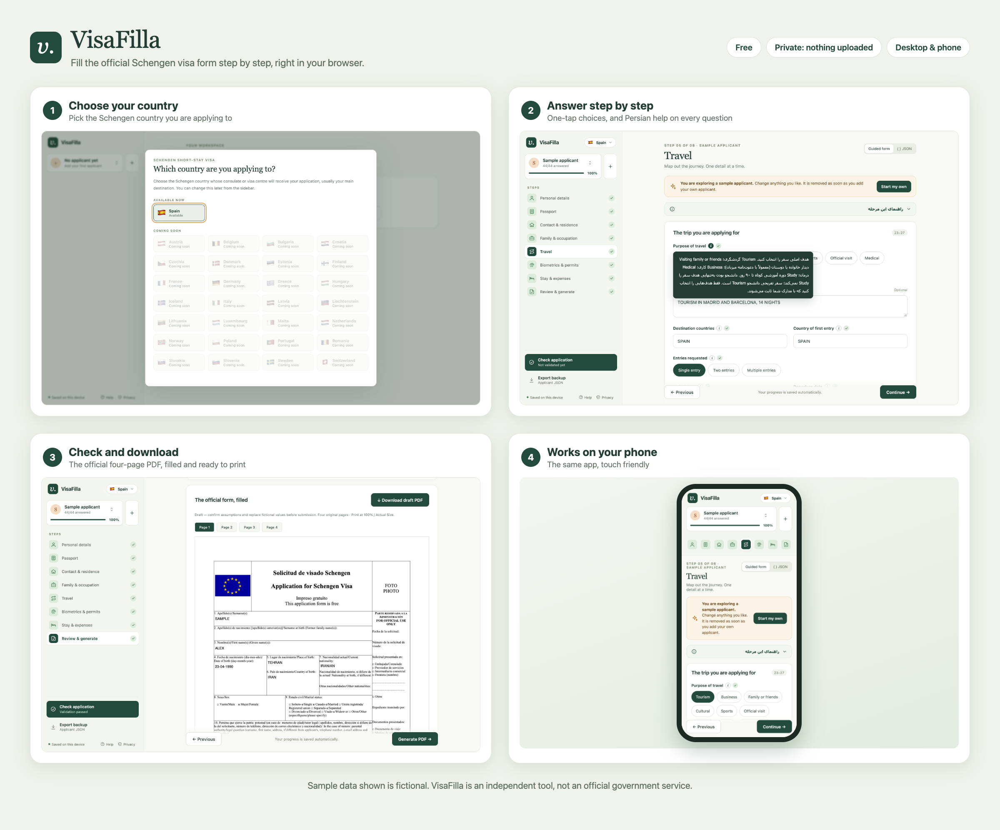
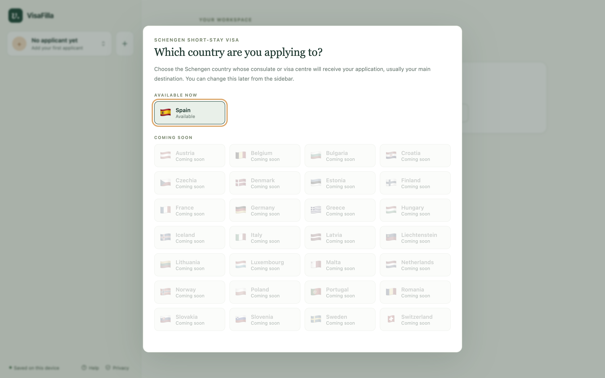
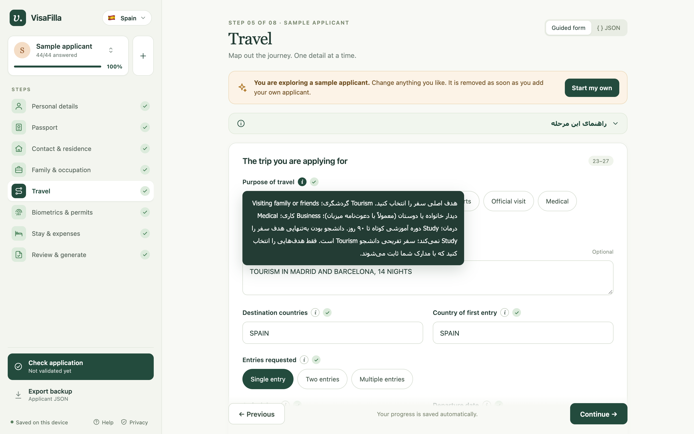
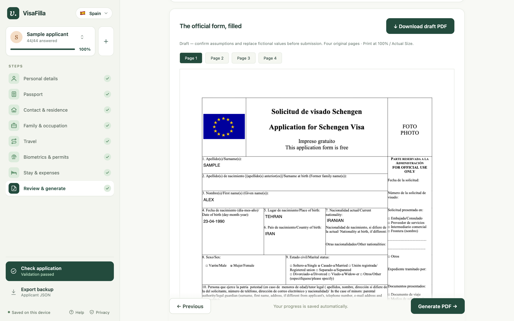
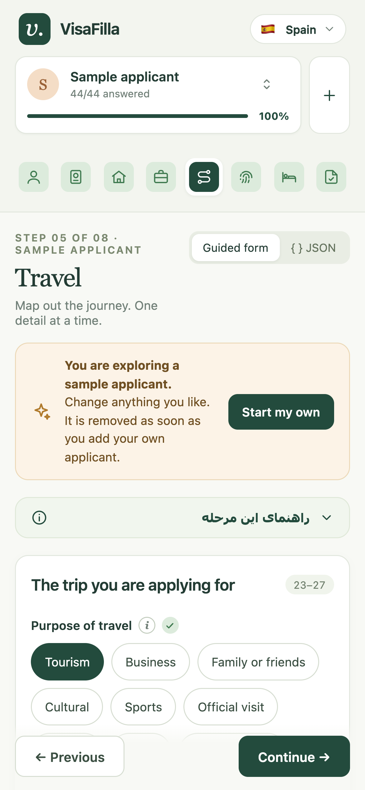

<div align="center">

# VisaFilla

**Fill in the official Schengen visa application form step by step, right in your browser.**

Free · Private: nothing is uploaded · Works on desktop and phone

[](LICENSE)




</div>

VisaFilla guides you through every question of the **Spanish Schengen short-stay visa application**, checks your answers for common mistakes, and produces the **official four-page PDF**, ready to print and sign. Each question has detailed help in **Persian (فارسی)**; labels are in English, matching the official form.

> **Disclaimer.** VisaFilla is an independent community project. It is **not** an official government service and is not affiliated with, endorsed by or connected to the Government of Spain, any consulate, any visa application centre or the European Union. It does not give legal or immigration advice. Visa rules, forms and required documents change; always check the current requirements with the consulate or visa centre handling your application, and review every answer on the generated PDF against your own documents before you sign and submit it. You use this software at your own risk.

## How it works

| | |
| --- | --- |
| **1. Choose your country** | Pick the Schengen country you are applying to. Spain is available now; more countries can be added. |
| **2. Answer step by step** | Eight short steps, from passport details to accommodation. Tap a choice, type the rest, and open the **i** next to any question for Persian guidance. |
| **3. Check your answers** | Mistakes are flagged as you go, in plain language: impossible dates, an expiring passport, stays outside your trip, text too long for its box. |
| **4. Download, print, sign** | Preview all four pages of the filled official form, download it, print at 100 % and sign page 4 by hand. |

Not sure where to start? Choose **Try with sample data** to explore a complete, fictional application first. It disappears as soon as you add your own.

<details>
<summary><b>More screenshots</b></summary>
<br>

| Choose your country | Answer step by step |
| --- | --- |
|  |  |
| **Check and download** | **On your phone** |
|  |  |

</details>

## Features

- **Every field of the official form**, in eight guided steps, with the official field numbers shown for each section.
- **Fast to fill in:** one-tap choices instead of dropdowns, dates that format themselves (`23041990` → `23-04-1990`), and **Enter** to jump to the next question.
- **Helpful checks:** passport validity, date order, stays within the journey, and whether every answer fits its box on the printed form. Text is never cut off.
- **Persian guidance on every question:** what to write, where to find it in your documents, the right format with an example, and common mistakes.
- **Several applicants**, for example a whole family, each saved separately, with progress and a tick for every finished step.
- **Several accommodation stays**, all printed within the original four pages.
- **Imported or copied answers are marked** until you confirm them; answers you type yourself never need extra clicks.
- **Backups:** export and import applicants as JSON, plus a command-line tool for batch use.

## Privacy

**Your data never leaves your device.**

- Your answers are checked and the PDF is filled **inside your browser tab**. The site only downloads its own files (the app, the form description and the blank official PDF) and never sends anything back.
- This is **enforced, not just promised**: a strict Content-Security-Policy (`connect-src 'self'`, see [`_headers`](webapp/static/_headers)) stops the page from contacting any other server, and there is no server-side code that could receive data.
- Drafts are stored only in your browser (IndexedDB). Clearing your browser data deletes them, so use **Export backup** to keep a copy. Generated PDFs exist only in the open tab.
- No account, no cookies for tracking, no analytics.

## Use it

### Online

Open the hosted site in any modern browser (Chrome, Edge, Firefox or Safari, on desktop or phone). Nothing to install.

### On your own computer

You need Python **3.12 or newer** ([python.org](https://www.python.org/downloads/)) and internet access the first time only, to install the two Python dependencies. Download or clone this repository and open a terminal in its folder.

- **macOS:** double-click **Start VisaFilla.command**. It sets everything up on first run and opens the app in your browser.
- **Windows:**

  ```bat
  py -m venv .venv
  .venv\Scripts\python -m pip install -e .
  .venv\Scripts\python -m webapp --open
  ```

- **macOS / Linux (manual):**

  ```bash
  python3 -m venv .venv
  .venv/bin/python -m pip install -e .
  .venv/bin/python -m webapp --open
  ```

The app opens at `http://127.0.0.1:8765` and serves the same files as the website, from your computer only, logging nothing. Keep the terminal open while you work and press **Control+C** to stop. If the port is busy, add `--port 8766`.

### Filling in an application

1. Choose **Add applicant** (or **Try with sample data** to look around first).
2. Work through the eight steps, copying details exactly as they appear in your passport and bookings.
3. Choose **Check application** and fix anything it points you to.
4. Generate the PDF in the last step, review all four pages and download it.
5. Print at **Actual size / 100 %** and sign where required.

If an answer still needs checking, or the fingerprint question is left blank, the file name is marked as a **draft**. The checks cover consistency and fit on the form, not whether your answers are true or enough for a visa.

## For developers

<details>
<summary><b>Command line</b></summary>
<br>

The Python PDF engine also works without the browser, using applicant JSON files:

```bash
# Create a blank applicant file to fill in
.venv/bin/python -m script.tools.create_blank spain --output input/Applicant.json

# Validate, preview or generate PDFs for every JSON file in input/
.venv/bin/python -m script input --validate-only
.venv/bin/python -m script input --preview
.venv/bin/python -m script input --overwrite
```

On macOS, `"./Start VisaFilla.command" <arguments>` forwards arguments to the same CLI. Relative paths are resolved from the project folder. The `input/` and `output/` folders are git-ignored, so applicant files and PDFs are never committed by accident.

</details>

<details>
<summary><b>Applicant JSON format</b></summary>
<br>

The browser app and CLI share one format, based on `template/base.template.json` (89 fields). Dates use `DD-MM-YYYY`. Unknown values are `null`; unused optional sections can be set to `null`. A blank file fails validation until it is completed. [`template/spain/sample.json`](template/spain/sample.json) is a complete, fictional example.

`accommodation` is a list with one entry per stay:

```json
"accommodation": [
  {
    "city": "Madrid",
    "country": "Spain",
    "type": "temporary_accommodation",
    "name": "Example apartment",
    "address": "123 Example Street, Madrid, Spain",
    "email": null,
    "phone": "+34 000 000 000",
    "check_in": "01-06-2027",
    "check_out": "04-06-2027",
    "confirmation_code": "EXAMPLE001"
  }
]
```

Check-out must follow check-in, and every stay must fall within the journey dates. Names, addresses, phones and emails print in field 30; booking dates and confirmation codes print in field 24. Text wraps and shrinks to fit its box; text that still does not fit fails validation instead of being cut off. Older single-object `accommodation` values are still accepted.

Set `previous_biometrics.fingerprints_taken` to `null` to leave both fingerprint boxes blank. Previous visas can be recorded with `visa_issuing_country` and `visa_entry_date`; leave `date` as `null` unless you know the actual fingerprint collection date.

The browser prints with standard Helvetica, which covers Western European letters (é, ñ, ü, ö …). Letters such as Ş or ł are refused with a request for the passport's Latin spelling, as used in its machine-readable lines.

</details>

<details>
<summary><b>Project structure</b></summary>
<br>

| Path | Contents |
| --- | --- |
| `webapp/static/` | **The complete website**: interface, in-browser engine (`engine/`), vendored libraries (`vendor/`), generated `meta.json` and `form/spain.pdf`, and security `_headers` |
| `webapp/` | Form labels (`fields.py`), Persian guidance (`guidance_fa.py`), build script, local static server; tests in `webapp/tests/` |
| `script/` | Python PDF engine, CLI, tools and template loader; tests in `script/tests/` |
| `template/base.template.json` | Shared blank Schengen applicant structure |
| `template/spain/` | Spain's blank form PDF, checkbox layout, geometry evidence, manifest, country template and sample applicant |
| `docs/screenshots/` | Screenshots used in this README |

The browser engine in `webapp/static/engine/` is a port of the Python engine. Parity tests run both on every test scenario and require identical errors, field values, checkboxes, line wrapping, font sizes and rendered pages.

**Adding another Schengen country:** add `template/<country>/<country>.template.json` that extends the shared base, overriding fields or adding country-only fields under `extras`:

```json
{
  "extends": "../base.template.json",
  "overrides": { "personal": { "surname": null } },
  "extras": { "national_scheme": null }
}
```

The country also needs its blank PDF, field coordinates and checkbox layout, following `template/spain/`. It then appears automatically as available in the country picker.

</details>

<details>
<summary><b>Development and tests</b></summary>
<br>

```bash
.venv/bin/python -m pip install -e ".[dev]"
.venv/bin/python -m pytest -q
.venv/bin/ruff check .
```

After changing the schema, labels, Persian guidance, coordinates or template, regenerate the website's data files (a test fails if you forget):

```bash
.venv/bin/python -m webapp.build
```

Parity tests need [Node.js](https://nodejs.org/) to run the browser engine; browser tests need Google Chrome or Playwright Chromium (`.venv/bin/python -m playwright install chromium`, or set `CHROME_PATH`). Tests that need a missing tool are skipped. All test data is fictional and lives in `script/tests/`.

</details>

<details>
<summary><b>Deploying</b></summary>
<br>

`webapp/static/` is a plain static site with no build step, so any static host works. The repository is set up for Cloudflare Workers static assets ([`wrangler.jsonc`](wrangler.jsonc)): connect the GitHub repository in the Cloudflare dashboard (Workers & Pages → Create → Import a repository) and use `npx wrangler deploy` as the deploy command. Every push to `main` then redeploys, and `_headers` applies the security headers.

</details>

## Contributing

Contributions are welcome: bug reports, improvements to the Persian guidance, and support for more Schengen countries. Please **never include real personal data** in issues, pull requests, test fixtures or screenshots; use the fictional sample applicant instead.

## Licence

VisaFilla is licensed under the [GNU Affero General Public License v3.0 or later](LICENSE). It uses [PyMuPDF](https://pymupdf.readthedocs.io/) (AGPL) and [Pydantic](https://docs.pydantic.dev/) (MIT) in Python, and ships [pdf-lib](https://pdf-lib.js.org/) 1.17.1 (MIT) and Mozilla's [pdf.js](https://mozilla.github.io/pdf.js/) 6.4.299 (Apache-2.0) unmodified in `webapp/static/vendor/`.

The blank application form in `template/spain/` is the public Schengen visa application form published by the Spanish authorities and is included unchanged, for filling in only.
